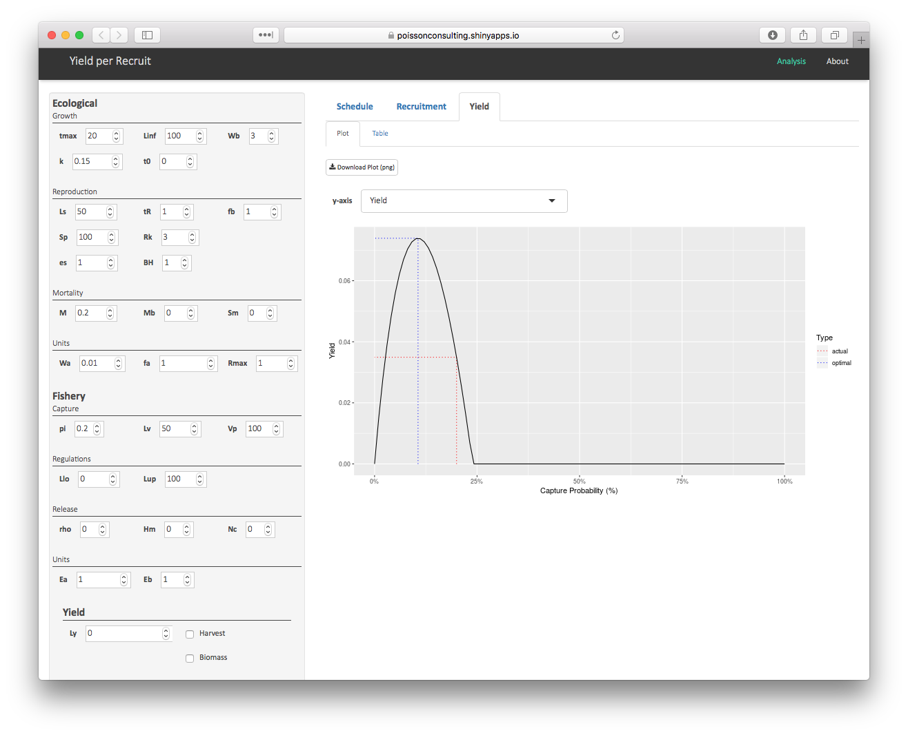

<!-- README.md is generated from README.Rmd. Please edit that file -->

```{r setup, include = FALSE}
knitr::opts_chunk$set(
  collapse = TRUE,
  comment = "#>",
  fig.path = "man/figures/README-"
)
```

# ypr 

[](https://www.tidyverse.org/lifecycle/#maturing)
[](https://travis-ci.org/poissonconsulting/ypr)
[](https://codecov.io/github/poissonconsulting/ypr?branch=master)
[](https://opensource.org/licenses/MIT)

## Introduction

[`ypr`](https://github.com/poissonconsulting/ypr) is an R package that implements equilibrium-based yield per recruit methods [@walters_fisheries_2004].

The yield can be based on the number of fish caught (or harvested) or biomass for all fish or just large (trophy) individuals.

The key life history parameters are

- The growth coefficient (`k`) and mean maximum length (`Linf`) from the Von Bertalanffy growth curve
- The length at which 50% mature (`Ls`)
- The length at which 50% vulnerable to harvest (`Lv`)
- The number of spawners per spawner at low density (`Rk`)

The calculations do not account for parameter uncertainty, environmental fluctuations, predator-prey dynamics, angler responses or density-dependent growth.

### Information

For definitions of all `r length(ypr::ypr_population())` population parameters see [`?ypr_population`](https://poissonconsulting.github.io/ypr/reference/ypr_population.html).

For an explanation of the calculations see the ypr [vignette](https://poissonconsulting.github.io/ypr/articles/ypr.html).

## Demonstration

### Schedule

```{r, fig.width=6, fig.height=4}
library(ypr)
population <- ypr_population(Rk = 5, Ls = 50, Rmax = 100)
ypr_plot_schedule(population, x = "Length", y = "Spawning")
head(ypr_schedule(population))
```

### Fish

```{r, fig.width=6, fig.height=4}
library(ypr)
ypr_plot_fish(population)
head(ypr_tabulate_fish(population))
```

### Stock-Recruitment

```{r, fig.width=6, fig.height=4}
ypr_plot_sr(population)
ypr_tabulate_sr(population)
```

### Yield

```{r, fig.width=6, fig.height=4}
ypr_plot_yield(population)
ypr_tabulate_yield(population)
```

### Uncertainty

```{r, fig.width=6, fig.height=6}
library(ggplot2)
populations <- ypr_populations(Rk = c(3,7), Ls = c(40, 60), Rmax = 100)
ypr_plot_yield(populations, plot_values = FALSE) +
  facet_grid(Rk~Ls)
```

## Installation

To install the latest development version from [GitHub](https://github.com/poissonconsulting/ypr)
```
# install.packages("devtools")
devtools::install_github("poissonconsulting/ypr")
```

To install the latest development version from the Poisson drat [repository](https://github.com/poissonconsulting/drat)
```
# install.packages("drat")
drat::addRepo("poissonconsulting")
install.packages("ypr")
```

### Interaction

To interactively explore the effects of altering individual parameters on the schedule, stock-recruitment and yield see the ypr shiny [app](https://poissonconsulting.shinyapps.io/ypr-shiny/).



## Citation

```{r, comment="", echo=FALSE}
citation(package = "ypr")
```

## Creditation

Development of ypr was supported by the [Habitat Conservation Trust Foundation](https://www.poissonconsulting.ca/orgs/hctf.html)
and the [Ministy of Forests, Lands and Natural Resource Operations](https://www.poissonconsulting.ca/orgs/mflnro.html).

The hex was designed by [The Forest](http://www.theforest.ca).

## Contribution

Please report any [issues](https://github.com/poissonconsulting/ypr/issues).

[Pull requests](https://github.com/poissonconsulting/ypr/pulls) are always welcome.

Please note that this project is released with a [Contributor Code of Conduct](CONDUCT.md). 
By participating in this project you agree to abide by its terms.

## References 
