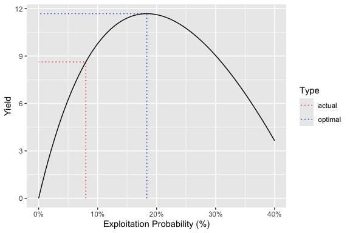

<!-- README.md is generated from README.Rmd. Please edit that file -->

# ypr 

<!-- badges: start -->

[](https://lifecycle.r-lib.org/articles/stages.html#stable)
[](https://github.com/poissonconsulting/ypr/actions)
[](https://app.codecov.io/gh/poissonconsulting/ypr)
[](https://opensource.org/licenses/MIT)
[](https://cran.r-project.org/package=ypr)

<!-- badges: end -->

## Introduction

[`ypr`](https://github.com/poissonconsulting/ypr) is an R package that
implements equilibrium-based yield per recruit methods. Yield per
recruit methods can used to estimate the optimal yield (Walters and
Martell 2004) of a fish population with one or more ecotypes. The yield
can be based on the number of fish caught (or harvested) or biomass for
all fish or just large (trophy) individuals.

The key life history parameters are

-   The growth coefficient (`k`) and mean maximum length (`Linf`) from
    the Von Bertalanffy growth curve
-   The length at which 50% mature (`Ls`)
-   The length at which 50% vulnerable to harvest (`Lv`)
-   The interval annual natural mortality rate (`n`)
-   The lifetime number of spawners per spawner at low density (`Rk`)

and in the case of ecotypes

-   The relative proportion of recruits that belong to that ecotype
    (`RPR`)

The calculations do not account for stochasticity, predator-prey
dynamics, angler responses or density-dependent growth.

## Installation

To install the latest release from [CRAN](https://cran.r-project.org)

``` r
install.packages("ypr")
```

To install the developmental version from
[GitHub](https://github.com/poissonconsulting/ypr)

``` r
# install.packages("remotes")
remotes::install_github("poissonconsulting/ypr")
```

## Demonstration

### Schedule

``` r
library(ypr)
population <- ypr_population(Rk = 5, Ls = 50, Rmax = 100, rho = 0.6)
ypr_plot_schedule(population, x = "Length", y = "Spawning")
```

<!-- -->

``` r
ypr_tabulate_schedule(population)
#> # A tibble: 20 × 11
#>      Age Length Weight Fecundity Spawning NaturalMor…¹ Vulner…² Reten…³ Fishin…⁴
#>    <int>  <dbl>  <dbl>     <dbl>    <dbl>        <dbl>    <dbl>   <dbl>    <dbl>
#>  1     1   13.9   27.0      27.0 3.13e-56          0.2 3.13e-56     0.4 2.50e-57
#>  2     2   25.9  174.      174.  2.91e-29          0.2 2.91e-29     0.4 2.33e-30
#>  3     3   36.2  476.      476.  1.04e-14          0.2 1.04e-14     0.4 8.35e-16
#>  4     4   45.1  918.      918.  3.46e- 5          0.2 3.46e- 5     0.4 2.77e- 6
#>  5     5   52.8 1469.     1469.  9.95e- 1          0.2 9.95e- 1     0.4 7.96e- 2
#>  6     6   59.3 2090.     2090.  1.00e+ 0          0.2 1.00e+ 0     0.4 8.00e- 2
#>  7     7   65.0 2747.     2747.  1.00e+ 0          0.2 1.00e+ 0     0.4 8.00e- 2
#>  8     8   69.9 3412.     3412.  1.00e+ 0          0.2 1.00e+ 0     0.4 8.00e- 2
#>  9     9   74.1 4065.     4065.  1   e+ 0          0.2 1   e+ 0     0.4 8   e- 2
#> 10    10   77.7 4689.     4689.  1   e+ 0          0.2 1   e+ 0     0.4 8   e- 2
#> 11    11   80.8 5274.     5274.  1   e+ 0          0.2 1   e+ 0     0.4 8   e- 2
#> 12    12   83.5 5816.     5816.  1   e+ 0          0.2 1   e+ 0     0.4 8   e- 2
#> 13    13   85.8 6310.     6310.  1   e+ 0          0.2 1   e+ 0     0.4 8   e- 2
#> 14    14   87.8 6758.     6758.  1   e+ 0          0.2 1   e+ 0     0.4 8   e- 2
#> 15    15   89.5 7160.     7160.  1   e+ 0          0.2 1   e+ 0     0.4 8   e- 2
#> 16    16   90.9 7518.     7518.  1   e+ 0          0.2 1   e+ 0     0.4 8   e- 2
#> 17    17   92.2 7836.     7836.  1   e+ 0          0.2 1   e+ 0     0.4 8   e- 2
#> 18    18   93.3 8116.     8116.  1   e+ 0          0.2 1   e+ 0     0.4 8   e- 2
#> 19    19   94.2 8363.     8363.  1   e+ 0          0.2 1   e+ 0     0.4 8   e- 2
#> 20    20   95.0 8580.     8580.  1   e+ 0          0.2 1   e+ 0     0.4 8   e- 2
#> # … with 2 more variables: Survivorship <dbl>, FishedSurvivorship <dbl>, and
#> #   abbreviated variable names ¹​NaturalMortality, ²​Vulnerability, ³​Retention,
#> #   ⁴​FishingMortality
#> # ℹ Use `colnames()` to see all variable names
```

### Fish

``` r
ypr_plot_fish(population, color = "white")
ypr_tabulate_fish(population)
#> # A tibble: 20 × 8
#>      Age Survivors Spawners   Caught Harvested Released HandlingMortal…¹ Ecotype
#>    <dbl>     <dbl>    <dbl>    <dbl>     <dbl>    <dbl>            <dbl> <chr>  
#>  1     1    70.1   2.19e-54 4.39e-55  1.76e-55 2.63e-55                0 <NA>   
#>  2     2    56.1   1.63e-27 3.26e-28  1.30e-28 1.96e-28                0 <NA>   
#>  3     3    44.9   4.68e-13 9.36e-14  3.74e-14 5.62e-14                0 <NA>   
#>  4     4    35.9   1.24e- 3 2.48e- 4  9.93e- 5 1.49e- 4                0 <NA>   
#>  5     5    28.7   2.86e+ 1 5.72e+ 0  2.29e+ 0 3.43e+ 0                0 <NA>   
#>  6     6    21.1   2.11e+ 1 4.23e+ 0  1.69e+ 0 2.54e+ 0                0 <NA>   
#>  7     7    15.6   1.56e+ 1 3.11e+ 0  1.24e+ 0 1.87e+ 0                0 <NA>   
#>  8     8    11.5   1.15e+ 1 2.29e+ 0  9.16e- 1 1.37e+ 0                0 <NA>   
#>  9     9     8.43  8.43e+ 0 1.69e+ 0  6.74e- 1 1.01e+ 0                0 <NA>   
#> 10    10     6.20  6.20e+ 0 1.24e+ 0  4.96e- 1 7.44e- 1                0 <NA>   
#> 11    11     4.57  4.57e+ 0 9.13e- 1  3.65e- 1 5.48e- 1                0 <NA>   
#> 12    12     3.36  3.36e+ 0 6.72e- 1  2.69e- 1 4.03e- 1                0 <NA>   
#> 13    13     2.47  2.47e+ 0 4.95e- 1  1.98e- 1 2.97e- 1                0 <NA>   
#> 14    14     1.82  1.82e+ 0 3.64e- 1  1.46e- 1 2.18e- 1                0 <NA>   
#> 15    15     1.34  1.34e+ 0 2.68e- 1  1.07e- 1 1.61e- 1                0 <NA>   
#> 16    16     0.986 9.86e- 1 1.97e- 1  7.89e- 2 1.18e- 1                0 <NA>   
#> 17    17     0.726 7.26e- 1 1.45e- 1  5.81e- 2 8.71e- 2                0 <NA>   
#> 18    18     0.534 5.34e- 1 1.07e- 1  4.27e- 2 6.41e- 2                0 <NA>   
#> 19    19     0.393 3.93e- 1 7.86e- 2  3.15e- 2 4.72e- 2                0 <NA>   
#> 20    20     0.289 2.89e- 1 5.79e- 2  2.31e- 2 3.47e- 2                0 <NA>   
#> # … with abbreviated variable name ¹​HandlingMortalities
```

### Stock-Recruitment

``` r
ypr_plot_sr(population)
```

<!-- -->

``` r
ypr_tabulate_sr(population)
#> # A tibble: 3 × 7
#>   Type        pi     u    Eggs Recruits Spawners Fecundity
#>   <chr>    <dbl> <dbl>   <dbl>    <dbl>    <dbl>     <dbl>
#> 1 unfished 0     0     286350.     80      159.      3600.
#> 2 actual   0.2   0.08  167831.     70.1    108.      3112.
#> 3 optimal  0.458 0.183  84129.     54.0     63.7     2641.
```

### Yield

``` r
ypr_tabulate_yield(population)
#> # A tibble: 2 × 8
#>   Type       pi     u Yield   Age Length Weight Effort
#>   <chr>   <dbl> <dbl> <dbl> <dbl>  <dbl>  <dbl>  <dbl>
#> 1 actual  0.2   0.08   8.63  7.67   65.8  3112.   2.12
#> 2 optimal 0.458 0.183 11.7   6.87   62.6  2641.   5.82
ypr_plot_yield(population)
```

<!-- -->

## Information

For more information see the [Get
Started](https://poissonconsulting.github.io/ypr/articles/ypr.html)
vignette.

### Interaction

To interactively explore the effects of altering individual parameters
on the schedule, stock-recruitment and yield see the ypr shiny
[app](https://poissonconsulting.shinyapps.io/shinyypr/).


## Creditation

Development of ypr was partially supported by the [Habitat Conservation
Trust Foundation](https://www.poissonconsulting.ca/orgs/hctf.html) and
the [Ministry of Forests, Lands and Natural Resource
Operations](https://www.poissonconsulting.ca/orgs/mflnro.html).

The hex was designed by [The Forest](https://www.theforest.ca).

## Contribution

Please report any
[issues](https://github.com/poissonconsulting/ypr/issues).

[Pull requests](https://github.com/poissonconsulting/ypr/pulls) are
always welcome.

## Code of Conduct

Please note that the ypr project is released with a [Contributor Code of
Conduct](https://contributor-covenant.org/version/2/0/CODE_OF_CONDUCT.html).
By contributing to this project, you agree to abide by its terms

## References

<div id="refs" class="references csl-bib-body hanging-indent">

<div id="ref-walters_fisheries_2004" class="csl-entry">

Walters, Carl J., and Steven J. D. Martell. 2004. *Fisheries Ecology and
Management*. Princeton, N.J: Princeton University Press.

</div>

</div>
