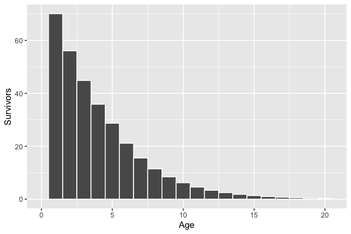

<!-- README.md is generated from README.Rmd. Please edit that file -->

# ypr 

[](https://www.tidyverse.org/lifecycle/#maturing)
[](https://travis-ci.org/poissonconsulting/ypr)
[](https://ci.appveyor.com/project/poissonconsulting/ypr)
[](https://codecov.io/github/poissonconsulting/ypr?branch=master)
[](https://opensource.org/licenses/MIT)
[](https://cran.r-project.org/package=ypr)


## Introduction

[`ypr`](https://github.com/poissonconsulting/ypr) is an R package that
implements equilibrium-based yield per recruit methods. Yield per
recruit methods can used to estimate the optimal yield for a fish
population (Walters and Martell 2004). The yield can be based on the
number of fish caught (or harvested) or biomass for all fish or just
large (trophy) individuals.

The key life history parameters are

  - The growth coefficient (`k`) and mean maximum length (`Linf`) from
    the Von Bertalanffy growth curve
  - The length at which 50% mature (`Ls`)
  - The length at which 50% vulnerable to harvest (`Lv`)
  - The instantaneous annual natural mortality rate (`M`)
  - The lifetime number of spawners per spawner at low density (`Rk`)

The calculations do not account for stochasticity, predator-prey
dynamics, angler responses or density-dependent growth.

### Information

For definitions of all 28 population parameters see
[`?ypr_population`](https://poissonconsulting.github.io/ypr/reference/ypr_population.html).

For an explanation of the calculations see the ypr
[vignette](https://poissonconsulting.github.io/ypr/articles/ypr.html).

## Demonstration

### Schedule

``` r
library(ypr)
population <- ypr_population(Rk = 5, Ls = 50, Rmax = 100, rho = 0.6)
ypr_plot_schedule(population, x = "Length", y = "Spawning")
```

<!-- -->

``` r
head(ypr_schedule(population))
#> # A tibble: 6 x 11
#>     Age Length Weight Fecundity  Spawning NaturalMortality Vulnerability
#>   <int>  <dbl>  <dbl>     <dbl>     <dbl>            <dbl>         <dbl>
#> 1     1   13.9   27.0      27.0  3.13e-56            0.181      3.13e-56
#> 2     2   25.9  174.      174.   2.91e-29            0.181      2.91e-29
#> 3     3   36.2  476.      476.   1.04e-14            0.181      1.04e-14
#> 4     4   45.1  918.      918.   3.46e- 5            0.181      3.46e- 5
#> 5     5   52.8 1469.     1469.   9.95e- 1            0.181      9.95e- 1
#> 6     6   59.3 2090.     2090.  10.00e- 1            0.181     10.00e- 1
#> # … with 4 more variables: Retention <dbl>, FishingMortality <dbl>,
#> #   Survivorship <dbl>, FishedSurvivorship <dbl>
```

### Fish

``` r
library(ypr)
ypr_plot_fish(population, color = "white")
```

<!-- -->

``` r
head(ypr_tabulate_fish(population))
#> # A tibble: 6 x 7
#>     Age Surviving Spawning   Caught Harvested Released HandlingMortality
#>   <dbl>     <dbl>    <dbl>    <dbl>     <dbl>    <dbl>             <dbl>
#> 1     1      69.3 2.17e-54 4.34e-55  1.73e-55 2.60e-55                 0
#> 2     2      56.7 1.65e-27 3.30e-28  1.32e-28 1.98e-28                 0
#> 3     3      46.4 4.84e-13 9.69e-14  3.87e-14 5.81e-14                 0
#> 4     4      38.0 1.31e- 3 2.63e- 4  1.05e- 4 1.58e- 4                 0
#> 5     5      31.1 3.10e+ 1 6.19e+ 0  2.48e+ 0 3.72e+ 0                 0
#> 6     6      23.4 2.34e+ 1 4.69e+ 0  1.88e+ 0 2.81e+ 0                 0
```

### Stock-Recruitment

``` r
ypr_plot_sr(population)
```

<!-- -->

``` r
ypr_tabulate_sr(population)
#> # A tibble: 3 x 7
#>   Type        pi     u    Eggs Recruits Spawners Fecundity
#>   <chr>    <dbl> <dbl>   <dbl>    <dbl>    <dbl>     <dbl>
#> 1 unfished 0     0     357733.     80.0    190.      3764.
#> 2 actual   0.2   0.08  201443.     69.3    125.      3232.
#> 3 optimal  0.418 0.167 106584.     54.4     76.5     2785.
```

### Yield

``` r
ypr_tabulate_yield(population)
#> # A tibble: 2 x 8
#>   Type       pi     u Yield   Age Length Weight Effort
#>   <chr>   <dbl> <dbl> <dbl> <dbl>  <dbl>  <dbl>  <dbl>
#> 1 actual  0.2   0.08   9.97  7.88   66.5  3232.   2.12
#> 2 optimal 0.418 0.167 12.8   7.11   63.6  2785.   5.14
ypr_plot_yield(population)
```

<!-- -->

### Uncertainty

``` r
library(ggplot2)
populations <- ypr_populations(Rk = c(3,7), Ls = c(40, 60), Rmax = 100)
ypr_plot_yield(populations, plot_values = FALSE) +
  facet_grid(Rk~Ls)
```

<!-- -->

## Installation

To install the latest release version from
[CRAN](https://cran.r-project.org)

    install.packages("ypr")

To install the latest development version from the Poisson drat
[repository](https://github.com/poissonconsulting/drat)

    if(!"drat" %in% installed.packages()[,1]) 
      install.packages("drat")
    drat::addRepo("poissonconsulting")
    install.packages("ypr")

To install the latest development version from
[GitHub](https://github.com/poissonconsulting/rpdo)

    if(!"devtools" %in% installed.packages()[,1]) 
      install.packages("devtools")
    devtools::install_github("poissonconsulting/err")
    devtools::install_github("poissonconsulting/checkr")
    devtools::install_github("poissonconsulting/ypr")

### Interaction

To interactively explore the effects of altering individual parameters
on the schedule, stock-recruitment and yield see the ypr shiny
[app](https://poissonconsulting.shinyapps.io/ypr-shiny/).


## Creditation

Development of ypr was supported by the [Habitat Conservation Trust
Foundation](https://www.poissonconsulting.ca/orgs/hctf.html) and the
[Ministy of Forests, Lands and Natural Resource
Operations](https://www.poissonconsulting.ca/orgs/mflnro.html).

The hex was designed by [The Forest](http://www.theforest.ca).

## Contribution

Please report any
[issues](https://github.com/poissonconsulting/ypr/issues).

[Pull requests](https://github.com/poissonconsulting/ypr/pulls) are
always welcome.

Please note that this project is released with a [Contributor Code of
Conduct](CONDUCT.md). By participating in this project you agree to
abide by its terms

## References

<div id="refs" class="references">

<div id="ref-walters_fisheries_2004">

Walters, Carl J., and Steven J. D. Martell. 2004. *Fisheries Ecology and
Management*. Princeton, N.J: Princeton University Press.

</div>

</div>
