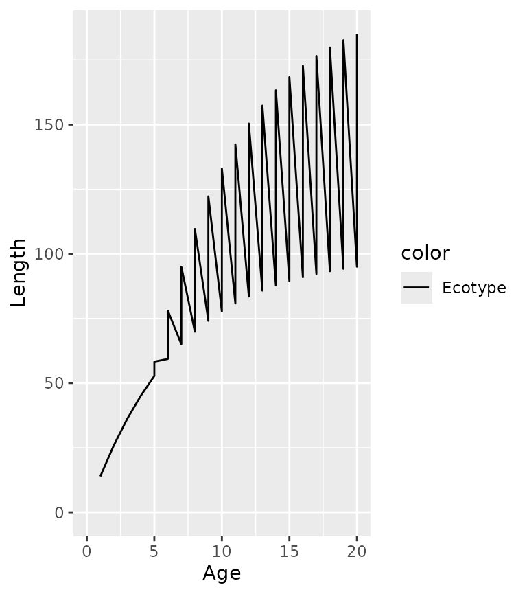
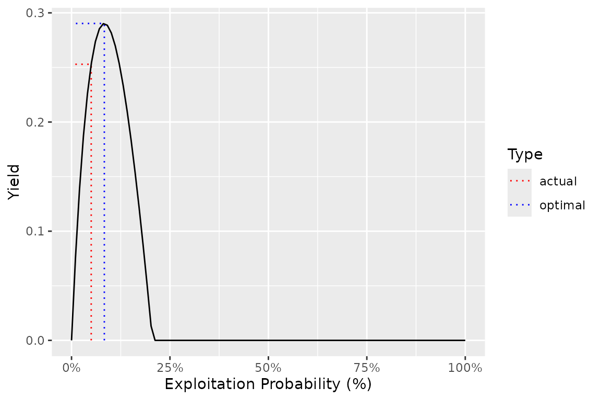

# Ecotypes

## Ecotypes

In the `ypr` package a population is considered to be group of
interbreeding fish that are indistinguishable to anglers. Ecotypes are
groups of individuals with a population that have different life-history
strategies. Consequently, ecotypes must share key fishery (`pi`, `Llo`,
`Lup`, `Nc`, `rho`, `Hm` and `q`) and stock recruitment (`BH`, `RK`,
`tR` and `Rmax`) parameters.y To use a yield-per-recruit approach it is
also necessary to assume that the relative proportion of recruits
(`RPR`) adopting each life-history strategy is independent of the size
and composition of the parental stock.

## Two Ecotypes

Consider a population with a smaller ecotype and a second larger ecotype
that delays maturation in order to achieve sufficient size to switch to
piscivory which allows it to grow much larger.

``` r
library(ypr)
library(ggplot2) # for plotting

ecotypes <- ypr_ecotypes(
  Linf2 = 200,
  L2 = c(100, 50),
  Ls = c(50, 75),
  pi = 0.05,
  names = c("small", "large"),
  RPR = c(0.8, 0.2)
)

ypr_plot_schedule(ecotypes) + scale_color_manual(values = c("black", "blue"))
```



``` r
ypr_plot_schedule(ecotypes, x = "Age", y = "Spawning") + scale_color_manual(values = c("black", "blue"))
```


### Fish

``` r
ypr_plot_fish(ecotypes, color = "white") + scale_fill_manual(values = c("black", "blue"))
```


``` r
ypr_plot_fish(ecotypes, x = "Length", y = "Caught", color = "white", binwidth = 15) + scale_fill_manual(values = c("black", "blue"))
```


### Stock-Recruitment

``` r
ypr_plot_sr(ecotypes, biomass = TRUE)
```


``` r
ypr_tabulate_sr(ecotypes, biomass = TRUE)
#> # A tibble: 3 × 7
#>   Type         pi      u  Eggs Recruits Spawners Fecundity
#>   <chr>     <dbl>  <dbl> <dbl>    <dbl>    <dbl>     <dbl>
#> 1 unfished 0      0      4085.    0.667    1.27      6431.
#> 2 actual   0.05   0.05   2483.    0.549    0.879     5653.
#> 3 optimal  0.0833 0.0833 1705.    0.455    0.656     5200.
```

### Yield

``` r
ypr_tabulate_yield(ecotypes, biomass = TRUE)
#> # A tibble: 2 × 8
#>   Type        pi      u Yield   Age Length Weight Effort
#>   <chr>    <dbl>  <dbl> <dbl> <dbl>  <dbl>  <dbl>  <dbl>
#> 1 actual  0.05   0.05   0.253  7.97   73.6  5474.  0.487
#> 2 optimal 0.0833 0.0833 0.290  7.64   71.9  5026.  0.825
ypr_plot_yield(ecotypes, biomass = TRUE)
```


