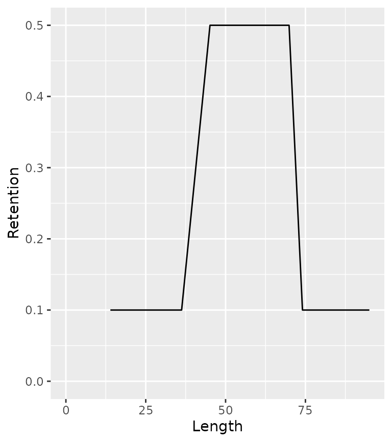
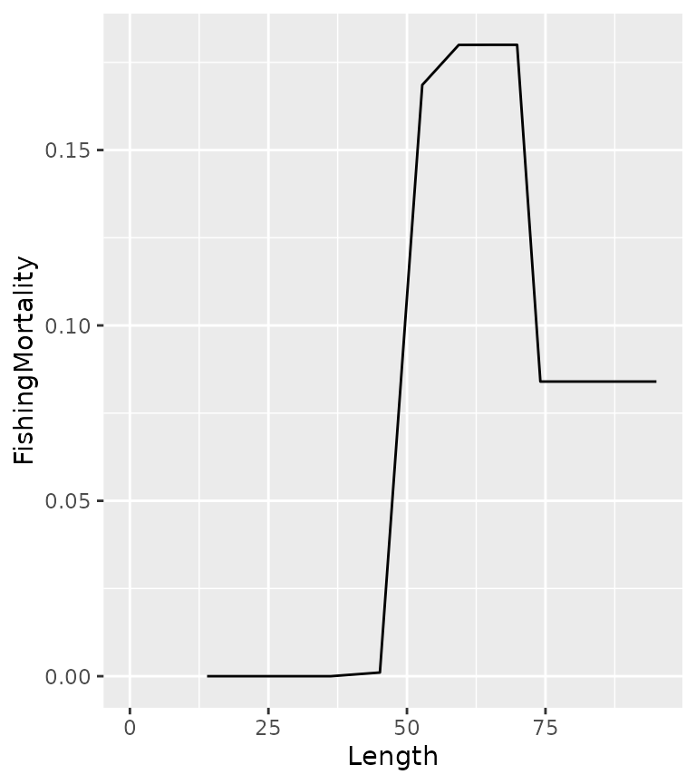
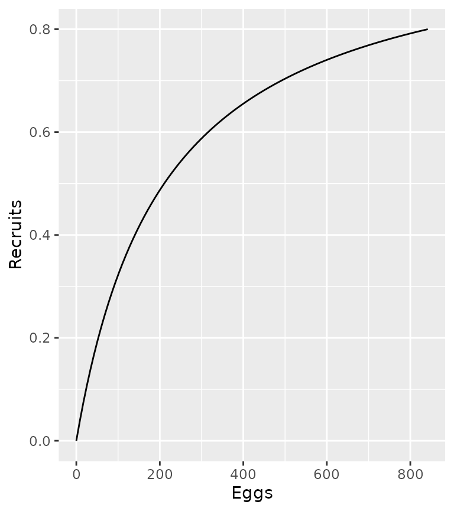
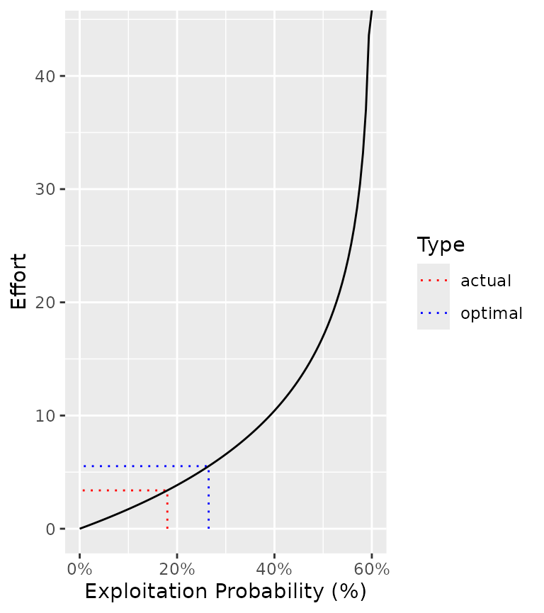

# Get Started with ypr

## Introduction

> Fish are born, they grow, they reproduce and they die – whether from
> natural causes or from fishing. That’s it. Modelers just use
> complicated (or not so complicated) math to iron out the details.
> Cooper (2006)

Equilibrium based yield per recruit (YPR) methods (Walters and Martell
2004) estimate the capture rate that optimizes the yield under the
assumption that there is no stochasticity and all density-dependence is
captured by the stock-recruitment relationship. The remaining population
processes of growth, reproduction and death are captured through a
series of relatively straight-forward deterministic equations.

| Parameter |   Value | Description                                                                                                           |
|:----------|--------:|:----------------------------------------------------------------------------------------------------------------------|
| tmax      |   20.00 | The maximum age (yr).                                                                                                 |
| k         |    0.15 | The VB growth coefficient (yr-1).                                                                                     |
| Linf      |  100.00 | The VB mean maximum length (cm).                                                                                      |
| t0        |    0.00 | The (theoretical) age at zero length (yr).                                                                            |
| k2        |    0.15 | The VB growth coefficient after length L2 (yr-1).                                                                     |
| Linf2     |  100.00 | The VB mean maximum length after length L2 (cm).                                                                      |
| L2        | 1000.00 | The length (or age if negative) at which growth switches from the first to second phase (cm or yr).                   |
| Wb        |    3.00 | The weight (as a function of length) scaling exponent.                                                                |
| Ls        |   50.00 | The length (or age if negative) at which 50 % mature (cm or yr).                                                      |
| Sp        |  100.00 | The maturity (as a function of length) power.                                                                         |
| es        |    1.00 | The annual probability of a mature fish spawning.                                                                     |
| Sm        |    0.00 | The spawning mortality probability.                                                                                   |
| fb        |    1.00 | The fecundity (as a function of weight) scaling exponent.                                                             |
| tR        |    1.00 | The age from which survival is density-independent (yr).                                                              |
| BH        |    1.00 | Recruitment follows a Beverton-Holt (1) or Ricker (0) relationship.                                                   |
| Rk        |    3.00 | The lifetime spawners per spawner at low density (or the egg to tR survival if between 0 and 1).                      |
| n         |    0.20 | The \strong{annual interval                                                                                           |
| nL        |    0.20 | The \strong{annual interval                                                                                           |
| Ln        | 1000.00 | The length (or age if negative) at which the annual interval natural mortality rate switches from n to nL (cm or yr). |
| Lv        |   50.00 | The length (or age if negative) at which 50 % vulnerable to harvest (cm or yr).                                       |
| Vp        |  100.00 | The vulnerability to harvest (as a function of length) power.                                                         |
| Llo       |    0.00 | The lower harvest slot length (cm).                                                                                   |
| Lup       | 1000.00 | The upper harvest slot length (cm).                                                                                   |
| Nc        |    0.00 | The slot limits non-compliance probability.                                                                           |
| pi        |    0.20 | The annual capture probability.                                                                                       |
| rho       |    0.00 | The release probability.                                                                                              |
| Hm        |    0.00 | The hooking mortality probability.                                                                                    |
| Rmax      |    1.00 | The number of recruits at the carrying capacity (ind).                                                                |
| Wa        |    0.01 | The (extrapolated) weight of a 1 cm individual (g).                                                                   |
| fa        |    1.00 | The (theoretical) fecundity of a 1 g female (eggs).                                                                   |
| q         |    0.10 | The catchability (annual probability of capture) for a unit of effort.                                                |
| RPR       |    1.00 | The relative proportion of recruits that are of the ecotype.                                                          |

Table 1. The 32 parameters with their default values and descriptions.

## Growth

### Length

In `ypr` length (in cm) at age (t) is assumed to follow a Von
Bertalanffy growth curve

L = L\_{\infty} \cdot (1 - \exp(-k \cdot (t-t_0)))

``` r
population <- ypr_population()
ypr_plot_schedule(population, "Age", "Length")
```


which can be biphasic

``` r
ypr_plot_schedule(ypr_population_update(population, L2 = 75, Linf2 = 200), "Age", "Length")
#> Warning: `ypr_population_update()` was deprecated in ypr 0.5.3.
#> ℹ Please use `ypr_update()` instead.
#> This warning is displayed once every 8 hours.
#> Call `lifecycle::last_lifecycle_warnings()` to see where this warning was
#> generated.
```


### Weight

The weight (W) at a given length is assumed to follow the classic
allometric relationship

W = w\_\alpha \cdot L^{w\_\beta}

``` r
population <- ypr_population_update(population, Wa = 0.01, Wb = 3)
ypr_plot_schedule(population, "Length", "Weight")
```


Its worth noting that w\_\alpha, which is the extrapolated weight (g) of
a 1 cm individual, is a scaling constant that only affects the estimate
of the yield (when calculated in terms of the biomass), ie, it does not
affect the estimate of the optimal capture rate.

## Reproduction

### Fecundity

The fecundity (F) is assumed to scale allometrically with the weight
according to the equation

F = f\_\alpha \cdot W^{f\_\beta}

``` r
population <- ypr_population_update(population, fa = 1, fb = 1)
ypr_plot_schedule(population, "Weight", "Fecundity")
```


f\_\alpha, which is the extrapolated eggs produced by a 1 g female, is a
scaling constant with no effect on the yield or optimal capture rate.

### Spawning

The probability of spawning at length L is determined by the equation

S = \frac{L^{S_p}}{L_s^{S_p} + L^{S_p}} \cdot es

``` r
population <- ypr_population_update(population, Ls = 50, Sp = 10, es = 0.8)
ypr_plot_schedule(population, "Length", "Spawning")
```


## Death

### Natural Mortality

By default the natural annual interval mortality rate (n) is assumed to
be constant

``` r
ypr_plot_schedule(population, "Length", "NaturalMortality")
```


although like growth it can vary biphasically

``` r
ypr_plot_schedule(ypr_population_update(population, nL = 0.15, Ln = 60), "Length", "NaturalMortality")
```


The natural mortality rate can also be affected by spawning mortality

``` r
population <- ypr_population_update(population, Sm = 0.5)
ypr_plot_schedule(population, "Length", "NaturalMortality")
```


### Fishing Mortality

The vulnerability to capture (V) is assumed to vary by length as follows

V = \frac{L^{V_p}}{L_v^{V_p} + L^{V_p}}

``` r
population <- ypr_population_update(population, Lv = 50, Vp = 50)
ypr_plot_schedule(population, "Length", "Vulnerability")
```


If V_p is 100 then vulnerability is effectively knife-edged.

The probabilty of being retained if captured (R) depends on the release
rate (\rho), the slot limits (L\_{lo} and L\_{up}) and the
non-compliance with the limits (N_c)

``` r
population <- ypr_population_update(population, rho = 0.5, Llo = 40, Lup = 70, Nc = 0.1)
ypr_plot_schedule(population, "Length", "Retention")
```



The fishing mortality (U) depends on V, R and the probability of capture
when fully vulnerable (pi) as well as the hooking mortality (H_m)

U = V \cdot \pi \cdot R + V \cdot \pi \cdot (1 - R) \cdot H_m

The calculation assumes that a released fish cannot be recaught in the
same year.

``` r
population <- ypr_population_update(population, pi = 0.3, Hm = 0.2)
ypr_plot_schedule(population, "Length", "FishingMortality")
```



## Recruitment

With growth, reproduction and death defined, the final task is to
estimate the recruitment (birth) rate.

This requires the lifetime number of spawners per spawner at low density
(R_k) and the recruitment age (R_t; by default 1) to be defined.

If recruitment follows a Beverton-Holt (BH = 1) curve then

R = \frac{\alpha \cdot E}{(\beta \cdot E + 1)}

``` r
population <- ypr_population_update(population, Rk = 3)
ypr_plot_sr(population, plot_values = FALSE)
```



where E is the annual eggs (stock) and R is the annual recruits at age
R_t.

With a Ricker curve (BH = 0) the relationship is as follows

R = \alpha \cdot E \cdot \exp (-\beta \cdot E)

``` r
population <- ypr_population_update(population, BH = 0L)
ypr_plot_sr(population, plot_values = FALSE)
```


The number of recruits at the carrying capacity (R\_\text{max}) is a
scaling constant that only affects the estimate of the yield.

Before calculating the recruitment it is important to introduce the
concept of the (unfished) survivorship (lx_a) which is the probability
of a recruit surviving to age a in the absence of fish mortality.

``` r
ypr_plot_schedule(population, "Age", "Survivorship")
```


The unfished survivorship (lx_a) is defined recursively by

lx\_{R_t} = 1, lx_a = lx\_{a-1} \cdot (1-N\_{a-1}) \\\text{for}\\ a \>
R_t where N_a is the annual interval natural mortality at age a.

And the fished survivorship (lx_a^F) is

lx\_{R_t}^F = 1, lx_a^F = lx\_{a-1}^F \cdot (1 - (1 - N\_{a-1}) \cdot
(1 - U\_{a-1})) \\\text{for}\\ a \> R_t

The lifetime number of eggs deposited per (unfished) recruit (\phi) is
then just

\phi = \sum\_{a = R_t}^{t\_\text{max}} lx_a \cdot F_a/2 \cdot S_a where
t\_\text{max} is the maximum age considered (by default 20) and F_a the
fecundity at age a is divided by two as the sex ratio is assumed to 1:1
and S_a is the probability of spawning.

The fished equivalent is denoted \phi_F.

It important to realize that at the unfished equilibrium the annual
number of recruits (R_0) is related to the annual egg deposition
according to the following equation

E_0 = \phi \cdot R_0

By definition

\alpha = \frac{R_k \cdot R_0}{E_0} = \frac{R_k}{\phi}

The \beta term of the Beverton-Holt curve can then be found by
rearranging the following formula

R_0 = \frac{\alpha \cdot \phi \cdot R_0}{\beta \cdot \phi \cdot R_0 + 1}

\beta \cdot \phi \cdot R_0 + 1 = \alpha \cdot \phi

\beta = \frac{\alpha \cdot \phi - 1}{\phi \cdot R_0}

The equivalent equation for the Ricker curve is arrived at as follows

R_0 = \alpha \cdot \phi \cdot R_0 \cdot \exp (-\beta \cdot \phi \cdot
R_0)

\frac{1}{\exp (-\beta \cdot \phi \cdot R_0)} = \alpha \cdot \phi

\beta \cdot \phi \cdot R_0 = \log(\alpha \cdot \phi)

\beta = \frac{\log(\alpha \cdot \phi)}{\phi \cdot R_0}

The number of recruits at the fished equilibrium (R\_{0F}) can then be
found for the Beverton-Holt curve as follows

R\_{0F} = \frac{\alpha \cdot \phi_F \cdot R\_{0F}}{\beta \cdot \phi_F
\cdot R\_{0F} + 1}

\beta \cdot \phi_F \cdot R\_{0F} + 1 = \alpha \cdot \phi_F R\_{0F} =
\frac{\alpha \cdot \phi_F - 1}{\beta \cdot \phi_F}

and for the Ricker

R\_{0F} = \alpha \cdot \phi_F \cdot R\_{0F} \cdot \exp (-\beta \cdot
\phi_F \cdot R\_{0F})

\frac{1}{\exp(-\beta \cdot \phi_F \cdot R\_{0F})} = \alpha \cdot \phi_F

\beta \cdot \phi_F \cdot R\_{0F} = \log(\alpha \cdot \phi_F)

R\_{0F} = \frac{\log(\alpha \cdot \phi_F)}{\beta \cdot \phi_F}

Finally the estimates are rescaled so that the carrying capacity is
identical to R\_\text{max} through the following transformations

\beta = \beta \cdot \kappa / R\_\text{max} R_0 = R_0 / \kappa \cdot
R\_\text{max} R\_{0F} = R\_{0F} / \kappa \cdot R\_\text{max}

where \kappa, which is the carrying capacity in the original scale, is
\alpha/\beta for the Beverton-Holt and \alpha/(\beta \cdot e) for the
Ricker curve.

## Yield

When the yield is simply the number of fish caught (irrespective of the
weight or whether or not its harvested) then it is given by

Y = \sum\_{a = R_t}^{t\_\text{max}} R\_{0F} \cdot lx_a^F \cdot \pi \cdot
V_a

if only harvested fish are considered it becomes

Y = \sum\_{a = R_t}^{t\_\text{max}} R\_{0F} \cdot lx_a^F \cdot \pi \cdot
V_a \cdot R

and if the total weight (in kg) is important then its

Y = \sum\_{a = R_t}^{t\_\text{max}} R\_{0F} \cdot lx_a^F \cdot \pi \cdot
V_a \cdot R \cdot W_a/1000

and if only trophy fish are to be considered then its

Y = \sum\_{a = R_t}^{t\_\text{max}} \text{if}(La \< L_y)\\ 0\\
\text{else}\\ R\_{0F} \cdot lx_a^F \cdot \pi \cdot V_a \cdot R \cdot
W_a/1000 where L_y is the minimum length of a trophy fish.

``` r
ypr_plot_yield(population, harvest = TRUE, biomass = TRUE, Ly = 60)
```


``` r
ypr_tabulate_yield(population, harvest = TRUE, biomass = TRUE, Ly = 60)
#> # A tibble: 2 × 8
#>   Type       pi     u  Yield   Age Length Weight Effort
#>   <chr>   <dbl> <dbl>  <dbl> <dbl>  <dbl>  <dbl>  <dbl>
#> 1 actual  0.3   0.18  0.0505  7.39   66.8  3006.   3.39
#> 2 optimal 0.441 0.265 0.0553  7.35   66.7  2978.   5.53
```

## Efficiency

The catchability `q` indicates the probability of capture for a unit of
effort (E). It is assumed to be related to \pi according to the
relationship \pi = 1 - \exp(\log(1-q)\cdot E) which can be rearranged to
give E = \frac{\log(1-\pi)}{\log(1-q)}.

``` r
ypr_plot_yield(population, y = "Effort", harvest = TRUE, biomass = TRUE, Ly = 60)
```



``` r
ypr_plot_yield(population, y = "YPUE", harvest = TRUE, biomass = TRUE, Ly = 60)
#> Warning: Removed 1 row containing missing values or values outside the scale range
#> (`geom_line()`).
```


## References

Cooper, Andrew B. 2006. *A Guide to Fisheries Stock Assessment: From
Data to Recommendations*. University of New Hampshire, Sea Grant College
Program.

Walters, Carl J., and Steven J. D. Martell. 2004. *Fisheries Ecology and
Management*. Princeton, N.J: Princeton University Press.
